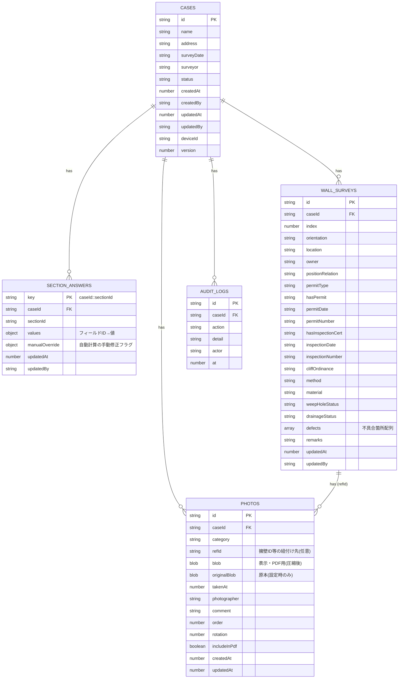

# データベース設計

## 採用方式

端末内IndexedDB(ライブラリ: [Dexie.js](https://dexie.org/))に一次保存する「オフラインファースト」構成です。
現場での通信不安定を前提に、まず端末内で完結して入力・保存・写真登録・PDF出力まで行える設計とし、
将来的にサーバー同期を追加する場合も同じテーブル構成を送信キューの元データとして流用できるようにしています
(サーバー同期は本バージョンでは未実装。方針は `docs/security.md` および `docs/open-issues.md` を参照)。

実装: `app/src/db/db.ts`(Dexieスキーマ定義)

## ER概要

## テーブル(Object Store)一覧

| テーブル | 主キー | インデックス | 説明 |
|---|---|---|---|
| `cases` | `id` | name, address, surveyDate, surveyor, status, updatedAt | 案件マスタ |
| `sectionAnswers` | `key`(`caseId::sectionId`) | caseId, sectionId, updatedAt | 画面(大分類)ごとの回答値 |
| `photos` | `id` | caseId, category, refId, order, updatedAt | 写真(設備現況・擁壁共通) |
| `wallSurveys` | `id` | caseId, index, updatedAt | 擁壁調査(1案件に複数) |
| `auditLogs` | `id` | caseId, at | 操作履歴(作成・更新・写真追加削除・PDF出力等) |

## 型定義

TypeScript型は `app/src/types.ts` を正とします(`SurveyCase` / `SectionAnswers` / `PhotoRecord` /
`WallSurveyRecord` / `WallDefect` / `AuditLogEntry` / `ValidationIssue`)。

## 複数端末編集時の扱い(要確認込み)

- `cases.updatedAt` / `updatedBy` / `deviceId` / `version` を保持しており、他端末での更新検知の土台としています。
- 現バージョンは**単一端末でのオフライン利用**を主眼としており、複数端末間の自動同期機能は未実装です。
- 複数端末で同一案件を編集する場合は、案件一覧の「複製」機能で明示的にコピーを作るか、将来のサーバー同期実装時に
  `version` を用いた楽観的排他制御(サーバー側が保持するバージョンと不一致の場合は上書きせず競合として通知)を
  行う設計を想定しています。詳細は `docs/open-issues.md` の該当項目を参照してください。

## オフラインデータの無制限保持を避ける設計

- 写真は既定で圧縮後画像のみ保持(原本保持は設定でオプトイン、`survey-keep-original-photo`)。
- 案件削除時はトランザクションで `sectionAnswers` / `photos` / `wallSurveys` / `auditLogs` を連鎖削除。
- 個人情報を含む案件データを無制限に端末へ残さないよう、PDF出力完了後の案件のエクスポート/バックアップ後に
  古い案件を一覧から削除する運用を想定(具体的な保持期間ポリシーは組織側で決定し、`docs/security.md` に追記してください)。
